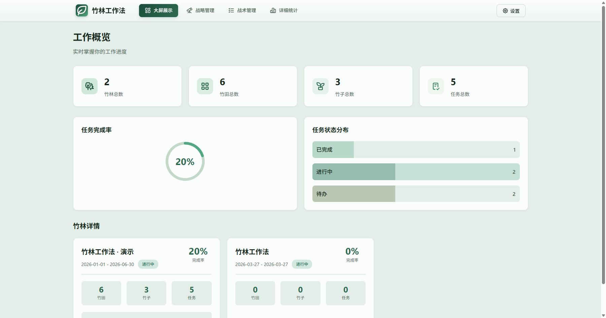
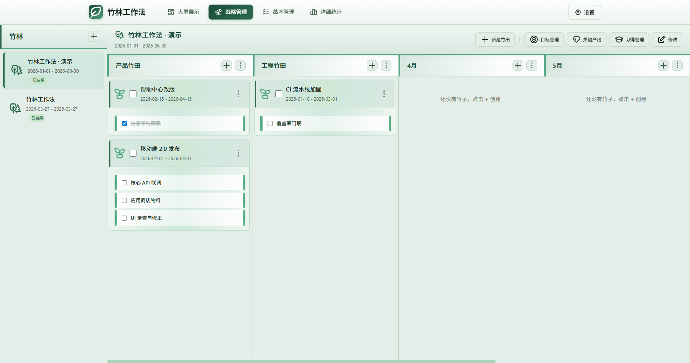
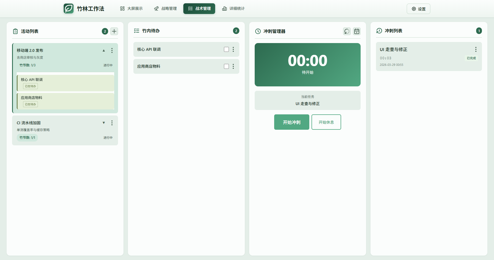
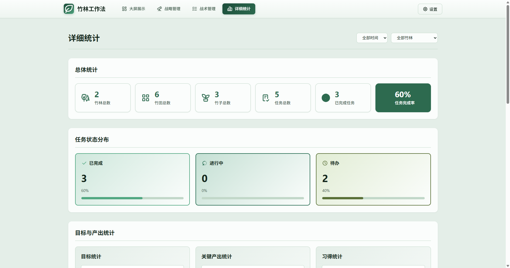

# Zhulin (竹林)

**[中文说明](README.md)** · Default for this file: English

## Overview

Zhulin is a full-stack app built around the “Bamboo Grove” work method: forests, fields, and bamboos structure long-term goals and short-term execution, with tactical time blocks (sections), sprints, and reviews. The repo includes a **Spring Boot** backend and an **Angular** frontend, with Docker Compose for one-shot deployment and full local development support.

## Features (summary)

- **Strategic**: bamboo forests / fields / bamboos, goals, key outputs, learning, planning and reviews.
- **Tactical**: activity list, in-bamboo todos, sections (planning / sprint / rest / interruption / daily review, etc.).

For product-oriented detail and frontend layout, see **[frontend/README.md](frontend/README.md)** (mostly in Chinese).


## Preview

### Large-screen dashboard



### Strategic management



### Tactical management



### Detailed statistics




## Tech stack

| Layer | Technology |
|-------|------------|
| Backend | Spring Boot 3.2, Java 21, Spring Data JPA |
| Frontend | Angular 19, TypeScript |
| Data | MySQL (default) or PostgreSQL — see backend config |
| Deploy | Docker Compose under `docker-deploy` |

## Repository layout

```
zhulin/
├── backend/        # REST API (see backend/README.md)
├── frontend/       # SPA (see frontend/README.md)
├── docker-deploy/  # Compose, sample .env, [deploy notes](docker-deploy/README.md)
├── docs/preview/   # README preview placeholders + notes
└── README.md       # Chinese documentation (default landing doc)
```

## Quick start: Docker

1. Install **Docker** and **Docker Compose** (v2: `docker compose`).
2. From the deploy folder:

   ```bash
   cd docker-deploy
   docker compose up -d --build
   ```

3. Open:
   - Frontend (Nginx proxies `/api`): `http://localhost`
   - Backend API (direct): `http://localhost:8080`
   - MySQL (in Compose): **not published to the host** by default (avoids clashing with a local MySQL); the backend uses `db:3306` on the Compose network. See **[docker-deploy/README.md](docker-deploy/README.md)**.

Optional: copy `docker-deploy/.env.example` to `.env` to change ports, DB password, `ZHULIN_DEMO_DATA`, etc. See **[docker-deploy/README.md](docker-deploy/README.md)**.

## Local development

### Backend

1. Install **JDK 21** (matches `java.version` in `backend/pom.xml`).
2. Create database `zhulin` and edit `application-mysql.yml` or `application-postgresql.yml` as needed.
3. In `backend`:

   ```bash
   # Windows
   mvnw.cmd spring-boot:run

   # Linux / macOS
   ./mvnw spring-boot:run
   ```

   Default port **8080**. Profile switching is described in **[backend/README.md](backend/README.md)**.

### Frontend

1. Install **Node.js 20+** and npm.
2. In `frontend`:

   ```bash
   npm install
   npm start
   ```

   Dev server defaults to **http://localhost:4200** (configure API proxy per your environment).

## Notes

- MySQL is the default profile; Hibernate may auto-update schema on startup (e.g. `ddl-auto: update`) — use controlled migrations in production.
- Demo seeding and similar behavior are controlled by backend properties (e.g. `zhulin.demo-data`); see `application.yml`.

## Further reading

- [backend/README.md](backend/README.md) — environment, DB profiles, sample REST paths  
- [frontend/README.md](frontend/README.md) — UI features, `src/app` layout, build output, local storage keys  
